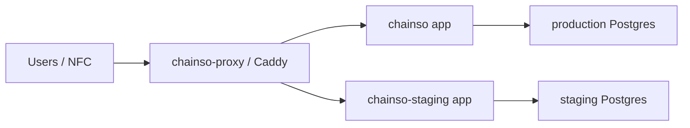

# Chainso environments

## Domains

```txt
chainso.ru
Production landing. Do not use for experiments.

golover.chainso.ru
Production NFC resolver. NFC chips should point here.

lover.chainso.ru
Production public couple pages.

staging.chainso.ru
Staging sandbox. Test changes here before production.
```

## VPS layout

```txt
/opt/chainso
Production app stack.

/opt/chainso-staging
Staging app stack.

/opt/chainso-proxy
Shared Caddy proxy for all domains.
```

## Docker stacks

```txt
chainso
Production app + production Postgres.

chainso-staging
Staging app + staging Postgres.

chainso-proxy
Shared Caddy. Routes domains to production or staging.
```



## Deploy staging

Use staging for every test build:

```bash
VPS_HOST=2.26.28.68 ./scripts/deploy-staging-vps.sh
```

This deploys the current local code to:

```txt
https://staging.chainso.ru
```

The script also runs Prisma migrations for the staging database.

## Deploy production

Only deploy production after staging is checked:

```bash
VPS_HOST=2.26.28.68 ./scripts/deploy-production-vps.sh
```

This deploys the current local code to:

```txt
https://chainso.ru
https://golover.chainso.ru
https://lover.chainso.ru
```

The script also runs Prisma migrations for the production database.

## Deploy proxy

Normally this is only needed when domain routing changes:

```bash
VPS_HOST=2.26.28.68 ./scripts/deploy-proxy-vps.sh
```

## Recommended git flow

```txt
feature branch -> staging deploy -> merge to main -> production deploy
```

Example:

```bash
git switch -c codex/some-change

# work, commit, test
VPS_HOST=2.26.28.68 ./scripts/deploy-staging-vps.sh

# after checking staging
git switch main
git merge codex/some-change
VPS_HOST=2.26.28.68 ./scripts/deploy-production-vps.sh
```

## Health checks

```bash
curl -I https://staging.chainso.ru
curl -I https://chainso.ru
curl -I https://golover.chainso.ru
curl -I https://lover.chainso.ru
```

```bash
ssh deploy@2.26.28.68 'docker ps --format "{{.Names}} {{.Status}}" | sort'
```

Expected containers:

```txt
chainso-app-1
chainso-postgres-1
chainso-proxy-caddy-1
chainso-staging-app-1
chainso-staging-postgres-1
```
