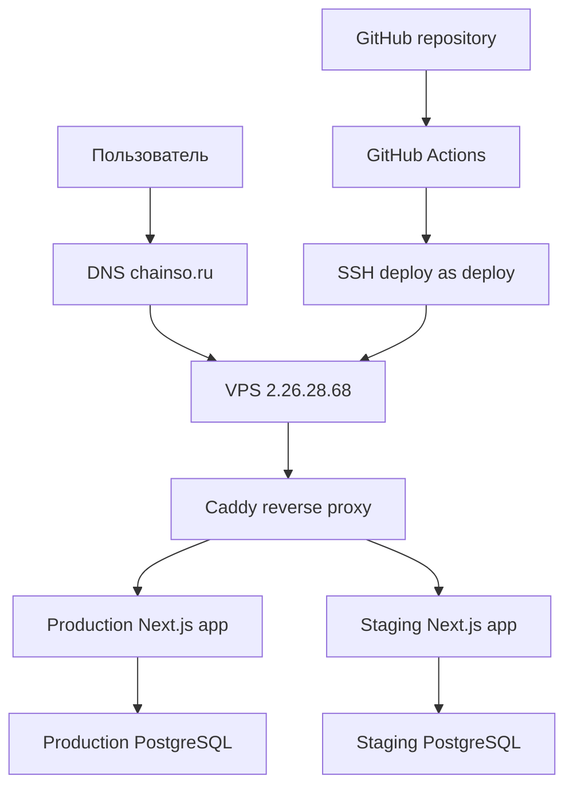
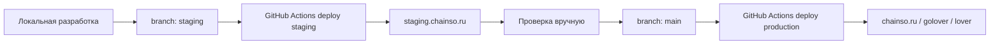
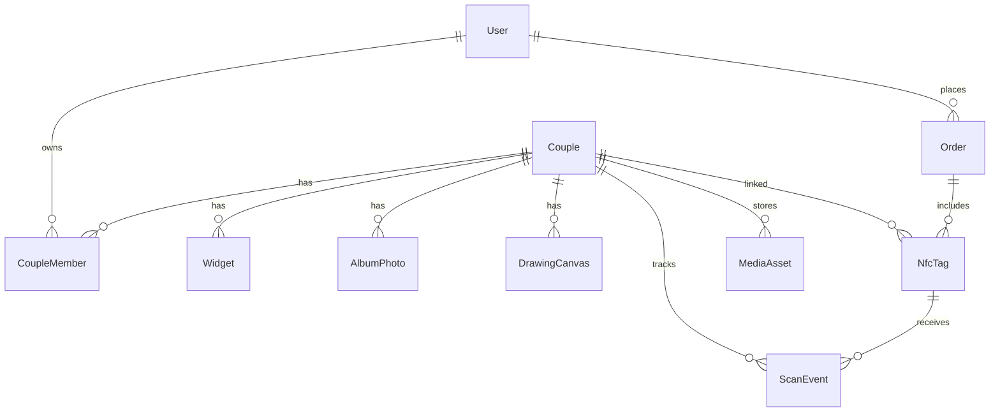
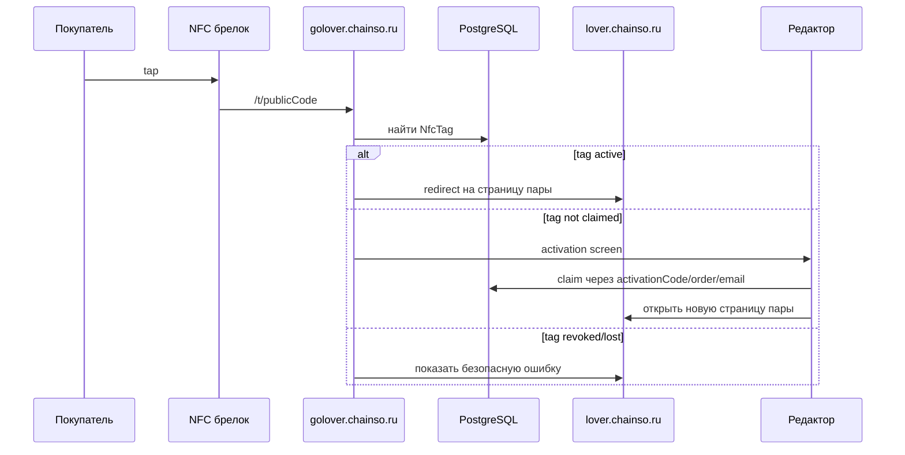
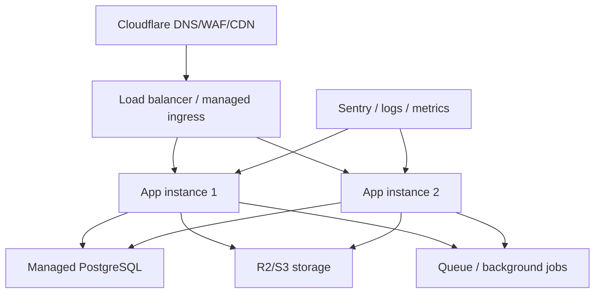

# Chainso: текущая инфраструктура, управление и roadmap

Дата актуализации: 2026-04-19

Этот документ описывает фактическую инфраструктуру Chainso на текущий момент: домены, VPS, Docker-окружения, GitHub Actions deploy, базу данных, команды управления и рекомендации по дальнейшему развитию. Это главный рабочий документ по инфраструктуре проекта.

## 1. Что такое Chainso

Chainso - SaaS-проект вокруг NFC-брелков для пар.

Целевая логика продукта:

```txt
Пара покупает NFC-брелок
-> человек тапает NFC
-> открывается публичный resolver golover.chainso.ru
-> resolver понимает, какой это брелок
-> если брелок активирован, ведет на страницу пары lover.chainso.ru
-> владельцы редактируют страницу через аккаунт и защищенный редактор
```

Важно: NFC-брелок должен быть публичным указателем, а не способом авторизации. Права на редактирование должны даваться только через auth и модель доступа в базе.

Сейчас уже поднята инфраструктура под этот путь: VPS, reverse proxy, production/staging окружения, PostgreSQL, Prisma-схема, GitHub Actions deploy.

## 2. Главные домены

```txt
chainso.ru
Главный домен. В будущем - лендинг и вход в продукт.

golover.chainso.ru
NFC resolver. В будущем сюда будут вести NFC-брелки: /t/[publicCode].

lover.chainso.ru
Публичная страница пары.

staging.chainso.ru
Тестовое окружение для проверки изменений перед продом.
```

Текущая маршрутизация:

```txt
chainso.ru              -> production app
golover.chainso.ru      -> production app
lover.chainso.ru        -> production app
staging.chainso.ru      -> staging app
```

## 3. Сервер

```txt
VPS IP: 2.26.28.68
SSH user для деплоя: deploy
Docker network edge: chainso_edge
Reverse proxy: Caddy
App runtime: Next.js standalone в Docker
Database: PostgreSQL 16 в Docker
```

Root-доступ не должен использоваться для ежедневной работы. Деплой и обслуживание делаются через пользователя `deploy`.

Безопасность, которая уже включена:

```txt
UFW включен
Открыты 22/tcp, 80/tcp, 443/tcp
SSH key-based доступ для deploy
Password SSH login был отключен
Production/staging app не публикуют порт 3000 наружу
PostgreSQL не публикует порт 5432 наружу
```

## 4. Схема инфраструктуры



## 5. Docker stacks на VPS

На VPS сейчас три независимых stack-а.

### 5.1. Production app

```txt
Path: /opt/chainso
Compose project: chainso
App container: chainso-app-1
Postgres container: chainso-postgres-1
Network alias для proxy: chainso-prod-app
Env file: /opt/chainso/infra/env/production.env
DB env file: /opt/chainso/infra/env/database.env
```

Production обслуживает:

```txt
chainso.ru
golover.chainso.ru
lover.chainso.ru
```

### 5.2. Staging app

```txt
Path: /opt/chainso-staging
Compose project: chainso-staging
App container: chainso-staging-app-1
Postgres container: chainso-staging-postgres-1
Network alias для proxy: chainso-staging-app
Env file: /opt/chainso-staging/infra/env/staging.env
DB env file: /opt/chainso-staging/infra/env/database.staging.env
```

Staging обслуживает:

```txt
staging.chainso.ru
```

### 5.3. Shared proxy

```txt
Path: /opt/chainso-proxy
Compose project: chainso-proxy
Container: chainso-proxy-caddy-1
Env file: /opt/chainso-proxy/infra/env/proxy.env
Config: /opt/chainso-proxy/infra/caddy/Caddyfile
```

Caddy слушает публичные порты:

```txt
80/tcp
443/tcp
443/udp
```

Caddy автоматически выпускает и обновляет HTTPS-сертификаты.

## 6. Docker Compose файлы

### 6.1. `compose.prod.yml`

Этот compose используется и для production, и для staging. Разница задается env-файлами.

Сервисы:

```txt
postgres
PostgreSQL 16, внутренний volume, внутренняя сеть data.

app
Next.js standalone app, зависит от healthy postgres, подключен к data и edge сетям.

migrate
Одноразовый tools-сервис для prisma migrate deploy.
```

Внешне наружу app не публикуется. Его видит только Caddy по Docker network `chainso_edge`.

### 6.2. `compose.proxy.yml`

Этот compose поднимает общий Caddy proxy.

Он читает:

```txt
PROD_DOMAINS
PROD_UPSTREAM
STAGING_DOMAINS
STAGING_UPSTREAM
EDGE_NETWORK
```

По умолчанию:

```txt
PROD_UPSTREAM=chainso-prod-app:3000
STAGING_UPSTREAM=chainso-staging-app:3000
```

## 7. GitHub Actions deploy

Файл workflow:

```txt
.github/workflows/deploy.yml
```

Логика:

```txt
push в staging -> deploy staging
push в main    -> deploy production
manual run     -> можно выбрать staging или production
```

Схема:



GitHub Secrets:

```txt
VPS_HOST
IP сервера.

VPS_USER
deploy

VPS_SSH_KEY_B64
Base64-версия приватного SSH-ключа для deploy.

VPS_SSH_KEY
Raw private key fallback, если не используется base64.
```

Сейчас основной вариант - `VPS_SSH_KEY_B64`.

Локальный приватный ключ GitHub Actions:

```txt
/Users/giovanni/.ssh/chainso_github_actions
```

Публичная часть добавлена на сервер:

```txt
deploy@2.26.28.68:~/.ssh/authorized_keys
```

## 8. Правильный Git-flow

Ежедневная разработка:

```bash
git switch staging
git pull --rebase origin staging
# делаешь изменения
git add .
git commit -m "описание изменений"
git push origin staging
```

После push автоматически обновится:

```txt
https://staging.chainso.ru
```

Когда staging проверен и можно выкатывать в production:

```bash
git switch main
git pull origin main
git merge origin/staging
git push origin main
```

После push в `main` автоматически обновятся:

```txt
https://chainso.ru
https://golover.chainso.ru
https://lover.chainso.ru
```

Если делаешь Pull Request в GitHub UI, направление должно быть строго таким:

```txt
base: main
compare: staging
```

Неправильно:

```txt
base: staging
compare: main
```

Если сделать наоборот, ты вольешь production обратно в staging, и production не обновится.

## 9. Как проверить, что деплой прошел

GitHub Actions:

```txt
https://github.com/hertz143g/chainso/actions
```

Проверить домены:

```bash
curl -I https://staging.chainso.ru
curl -I https://lover.chainso.ru
curl -I https://golover.chainso.ru
curl -I https://chainso.ru
```

Ожидаемый базовый результат:

```txt
HTTP/2 200
via: 1.1 Caddy
```

Проверить контейнеры на VPS:

```bash
ssh deploy@2.26.28.68 "docker ps --format 'table {{.Names}}\t{{.Status}}\t{{.Ports}}'"
```

Проверить production stack:

```bash
ssh deploy@2.26.28.68 "cd /opt/chainso && docker compose --env-file infra/env/production.env -f compose.prod.yml ps"
```

Проверить staging stack:

```bash
ssh deploy@2.26.28.68 "cd /opt/chainso-staging && docker compose --env-file infra/env/staging.env -f compose.prod.yml ps"
```

Проверить proxy:

```bash
ssh deploy@2.26.28.68 "cd /opt/chainso-proxy && docker compose --env-file infra/env/proxy.env -f compose.proxy.yml ps"
```

## 10. Логи

Production app:

```bash
ssh deploy@2.26.28.68 "cd /opt/chainso && docker compose --env-file infra/env/production.env -f compose.prod.yml logs -f app"
```

Staging app:

```bash
ssh deploy@2.26.28.68 "cd /opt/chainso-staging && docker compose --env-file infra/env/staging.env -f compose.prod.yml logs -f app"
```

Production database:

```bash
ssh deploy@2.26.28.68 "cd /opt/chainso && docker compose --env-file infra/env/production.env -f compose.prod.yml logs -f postgres"
```

Staging database:

```bash
ssh deploy@2.26.28.68 "cd /opt/chainso-staging && docker compose --env-file infra/env/staging.env -f compose.prod.yml logs -f postgres"
```

Caddy proxy:

```bash
ssh deploy@2.26.28.68 "cd /opt/chainso-proxy && docker compose --env-file infra/env/proxy.env -f compose.proxy.yml logs -f caddy"
```

## 11. База данных

Используется PostgreSQL 16 в Docker.

Production:

```txt
/opt/chainso
DB env: /opt/chainso/infra/env/database.env
Docker volume: chainso_postgres_data
```

Staging:

```txt
/opt/chainso-staging
DB env: /opt/chainso-staging/infra/env/database.staging.env
Docker volume: chainso-staging_postgres_data
```

Prisma schema:

```txt
prisma/schema.prisma
```

Миграции:

```txt
prisma/migrations/
```

Сейчас созданы таблицы:

```txt
User
Couple
CoupleMember
NfcTag
Order
Widget
AlbumPhoto
DrawingCanvas
MediaAsset
ScanEvent
AuditEvent
_prisma_migrations
```

Проверить production таблицы:

```bash
ssh deploy@2.26.28.68 "cd /opt/chainso && . infra/env/database.env && docker compose --env-file infra/env/production.env -f compose.prod.yml exec -T postgres psql -U \"\$POSTGRES_USER\" -d \"\$POSTGRES_DB\" -c '\dt'"
```

Проверить staging таблицы:

```bash
ssh deploy@2.26.28.68 "cd /opt/chainso-staging && . infra/env/database.staging.env && docker compose --env-file infra/env/staging.env -f compose.prod.yml exec -T postgres psql -U \"\$POSTGRES_USER\" -d \"\$POSTGRES_DB\" -c '\dt'"
```

Применить миграции вручную на production:

```bash
ssh deploy@2.26.28.68 "cd /opt/chainso && set -a && . infra/env/production.env && . infra/env/database.env && set +a && docker compose --profile tools --env-file infra/env/production.env -f compose.prod.yml run --rm migrate"
```

Применить миграции вручную на staging:

```bash
ssh deploy@2.26.28.68 "cd /opt/chainso-staging && set -a && . infra/env/staging.env && . infra/env/database.staging.env && set +a && docker compose --profile tools --env-file infra/env/staging.env -f compose.prod.yml run --rm migrate"
```

Обычно вручную миграции запускать не нужно: deploy script делает это сам.

## 12. Backend-модель, которая уже заложена

В Prisma уже заложено ядро будущего backend:



Ключевая идея:

```txt
NFC идентифицирует брелок.
Auth идентифицирует пользователя.
CoupleMember решает, кто может редактировать страницу.
publicCode ведет на страницу, но не дает прав.
```

## 13. Текущее состояние приложения

Frontend сейчас остается основным пользовательским слоем.

Что уже есть в приложении:

```txt
страница пары
настройки
темы
виджеты
альбом
холсты
режим редактирования
localStorage state
базовая DB/API подготовка
```

Что уже сделано на backend/infrastructure уровне:

```txt
PostgreSQL поднят отдельно для prod и staging
Prisma schema создана
Prisma migration применена
API route /api/couples/[slug] подготовлен
Docker build умеет генерировать Prisma client
Deploy pipeline умеет применять миграции
```

Что еще не готово как полноценный продукт:

```txt
auth
личный кабинет
реальный editor -> backend save
публичный route /p/[slug]
NFC resolver /t/[publicCode]
activation/claim flow
object storage для фото/холстов
админка заказов и NFC-партий
```

## 14. NFC-flow, который нужно реализовать дальше

Целевая схема:



Рекомендуемый URL в NFC:

```txt
https://golover.chainso.ru/t/[publicCode]
```

Почему не `lover.chainso.ru` напрямую:

```txt
golover.chainso.ru отвечает за распознавание брелка, статистику сканов и активацию.
lover.chainso.ru отвечает за саму публичную страницу пары.
```

## 15. Управление proxy

Перезапустить Caddy:

```bash
ssh deploy@2.26.28.68 "cd /opt/chainso-proxy && docker compose --env-file infra/env/proxy.env -f compose.proxy.yml restart caddy"
```

Пересобрать proxy config из репозитория:

```bash
VPS_HOST=2.26.28.68 ./scripts/deploy-proxy-vps.sh
```

Проверить Caddy config на VPS:

```bash
ssh deploy@2.26.28.68 "cd /opt/chainso-proxy && docker compose --env-file infra/env/proxy.env -f compose.proxy.yml exec caddy caddy validate --config /etc/caddy/Caddyfile"
```

## 16. Ручной deploy без GitHub Actions

Если GitHub Actions недоступен, можно деплоить локально.

Staging:

```bash
VPS_HOST=2.26.28.68 ./scripts/deploy-staging-vps.sh
```

Production:

```bash
VPS_HOST=2.26.28.68 ./scripts/deploy-production-vps.sh
```

Proxy:

```bash
VPS_HOST=2.26.28.68 ./scripts/deploy-proxy-vps.sh
```

Ручной production deploy стоит использовать аккуратно: он обходит привычный GitHub Actions flow.

## 17. Backup

Сейчас автоматические backup-и еще не настроены. Это важная зона риска.

Ручной backup production DB:

```bash
ssh deploy@2.26.28.68 "cd /opt/chainso && . infra/env/database.env && docker compose --env-file infra/env/production.env -f compose.prod.yml exec -T postgres pg_dump -U \"\$POSTGRES_USER\" \"\$POSTGRES_DB\"" > chainso-prod-$(date +%Y%m%d-%H%M%S).sql
```

Ручной backup staging DB:

```bash
ssh deploy@2.26.28.68 "cd /opt/chainso-staging && . infra/env/database.staging.env && docker compose --env-file infra/env/staging.env -f compose.prod.yml exec -T postgres pg_dump -U \"\$POSTGRES_USER\" \"\$POSTGRES_DB\"" > chainso-staging-$(date +%Y%m%d-%H%M%S).sql
```

Рекомендация: настроить ежедневные encrypted backups в S3/R2-compatible storage и периодически проверять restore.

## 18. Что делать при типовых проблемах

### Push rejected non-fast-forward

Причина: локальная ветка отстала от GitHub.

Для staging:

```bash
git switch staging
git pull --rebase origin staging
git push origin staging
```

Для main:

```bash
git switch main
git pull --rebase origin main
git push origin main
```

Если появились конфликты, не делать force push наугад. Сначала решить конфликт, затем:

```bash
git add .
git rebase --continue
```

### Изменения появились на staging, но не на lover

Причина почти всегда одна из двух:

```txt
изменения не смержены в main
PR был создан в обратную сторону
```

Правильный PR:

```txt
base: main
compare: staging
```

После merge должен появиться GitHub Actions run по ветке `main`.

### GitHub Actions показывает cancelled

`cancelled` не всегда значит, что код сломан. Это значит, что job был отменен. Нужно смотреть новый run и состояние VPS.

Проверить:

```bash
curl -s 'https://api.github.com/repos/hertz143g/chainso/actions/runs?per_page=3'
```

### Домен открывается, но показывает старую версию

Проверить:

```bash
curl -I https://lover.chainso.ru
ssh deploy@2.26.28.68 "docker ps --format 'table {{.Names}}\t{{.Status}}\t{{.Ports}}'"
```

Потом проверить, был ли deploy именно по `main`, а не по `staging`.

### App unhealthy

Смотреть логи:

```bash
ssh deploy@2.26.28.68 "cd /opt/chainso && docker compose --env-file infra/env/production.env -f compose.prod.yml logs --tail 200 app"
```

Проверить DB:

```bash
ssh deploy@2.26.28.68 "cd /opt/chainso && . infra/env/database.env && docker compose --env-file infra/env/production.env -f compose.prod.yml exec -T postgres pg_isready -U \"\$POSTGRES_USER\" -d \"\$POSTGRES_DB\""
```

## 19. Безопасность

Что уже хорошо:

```txt
HTTPS через Caddy
Security headers
UFW active
Отдельный deploy user
DB не торчит наружу
App не торчит наружу
Секреты исключены из rsync
GitHub Actions ходит по SSH-ключу
```

Что нужно усилить:

```txt
регулярные backup-и
fail2ban или аналог
Sentry
uptime monitoring
rate limit для будущих auth/NFC endpoints
Cloudflare DNS/WAF перед доменами
отдельные credentials для staging/prod
секреты через secret manager или минимум строгий chmod
audit log для действий владельцев страниц
```

Особенно важно: пароль root, который когда-либо попадал в чат/историю, нужно считать скомпрометированным и заменить.

## 20. Рекомендации по развитию

### Этап 1. Закрепить текущую инфраструктуру

```txt
настроить uptime monitor
настроить Sentry
настроить backup production DB
проверить restore backup-а
добавить basic smoke test после deploy
добавить branch protection для main
```

### Этап 2. Перенести данные из localStorage в backend

```txt
сделать auth
сделать /app как личный кабинет
сделать /p/[slug] как публичную страницу пары
сделать сохранение Couple/Widget/AlbumPhoto/DrawingCanvas в PostgreSQL
оставить localStorage только как draft/offline cache
```

### Этап 3. Реализовать NFC layer

```txt
route golover.chainso.ru/t/[publicCode]
таблица NfcTag уже готова
статусы MANUFACTURED/SOLD/CLAIMED/ACTIVE/REVOKED/LOST уже заложены
activation flow через activationCode/order/email
scan_events для статистики
```

### Этап 4. Подключить storage для медиа

```txt
Cloudflare R2 или S3-compatible storage
таблица MediaAsset уже готова
загрузка фото/холстов не в базу, а в object storage
compression pipeline: WebP/JPEG
проверка MIME/размера
CDN cache
```

### Этап 5. Админка и заказы

```txt
создание партий NFC
генерация publicCode/activationCode
связь order -> nfc_tag -> couple
статусы заказов
перевыпуск/блокировка брелков
поддержка пользователей
```

### Этап 6. Более зрелая production-инфраструктура

Текущий VPS нормален для MVP. Когда пойдет трафик и продажи, лучше постепенно двигаться к такой схеме:



Не нужно сразу прыгать в Kubernetes. Более разумный путь:

```txt
VPS MVP
-> VPS + managed backups + R2
-> managed Postgres
-> 2 app instances behind proxy
-> separate worker for media/jobs
-> managed platform only когда экономика проекта это оправдывает
```

## 21. Короткая памятка

Проверить staging:

```bash
curl -I https://staging.chainso.ru
```

Проверить production:

```bash
curl -I https://lover.chainso.ru
```

Деплой staging:

```bash
git switch staging
git pull --rebase origin staging
git push origin staging
```

Деплой production:

```bash
git switch main
git pull origin main
git merge origin/staging
git push origin main
```

Правильный PR:

```txt
base: main
compare: staging
```

Посмотреть containers:

```bash
ssh deploy@2.26.28.68 "docker ps"
```

Посмотреть app logs production:

```bash
ssh deploy@2.26.28.68 "cd /opt/chainso && docker compose --env-file infra/env/production.env -f compose.prod.yml logs -f app"
```

Посмотреть app logs staging:

```bash
ssh deploy@2.26.28.68 "cd /opt/chainso-staging && docker compose --env-file infra/env/staging.env -f compose.prod.yml logs -f app"
```

