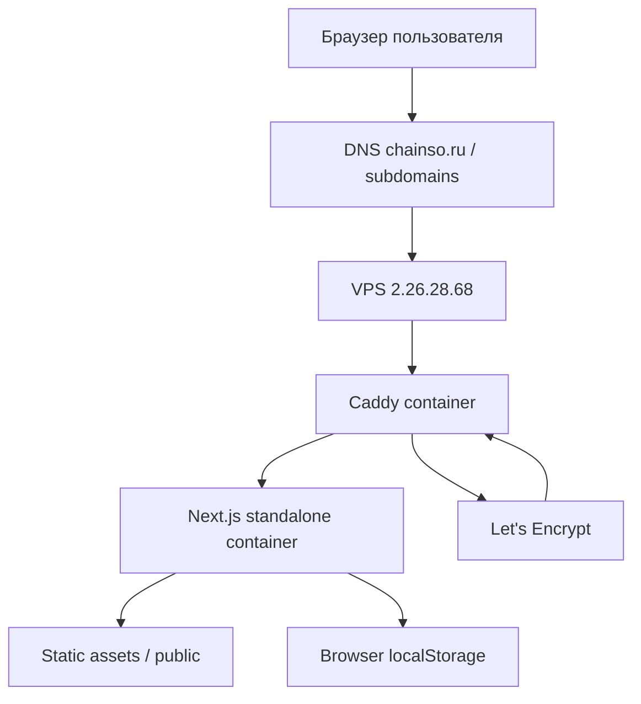
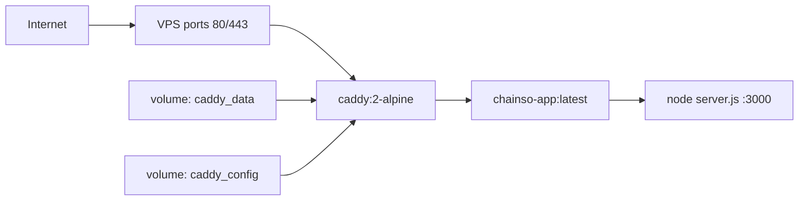
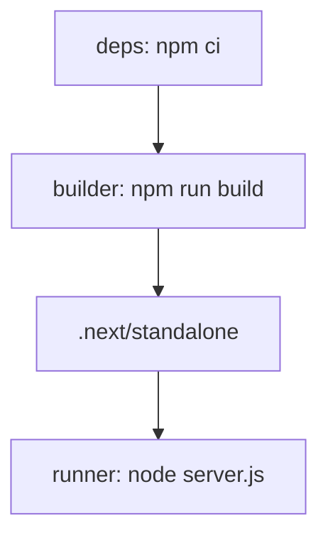
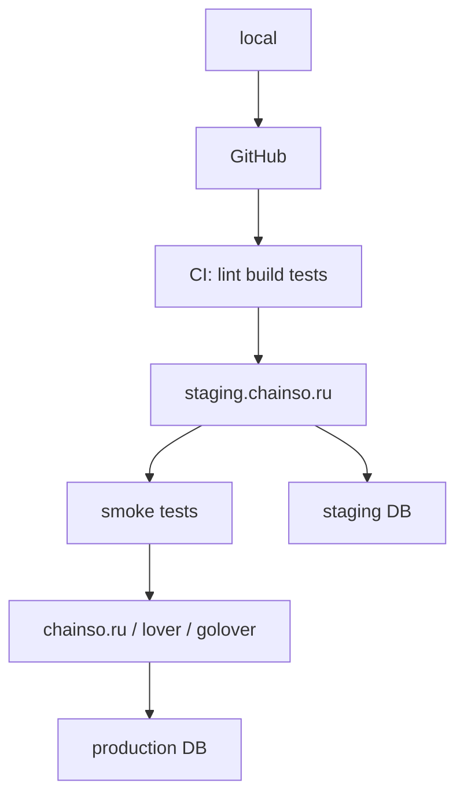
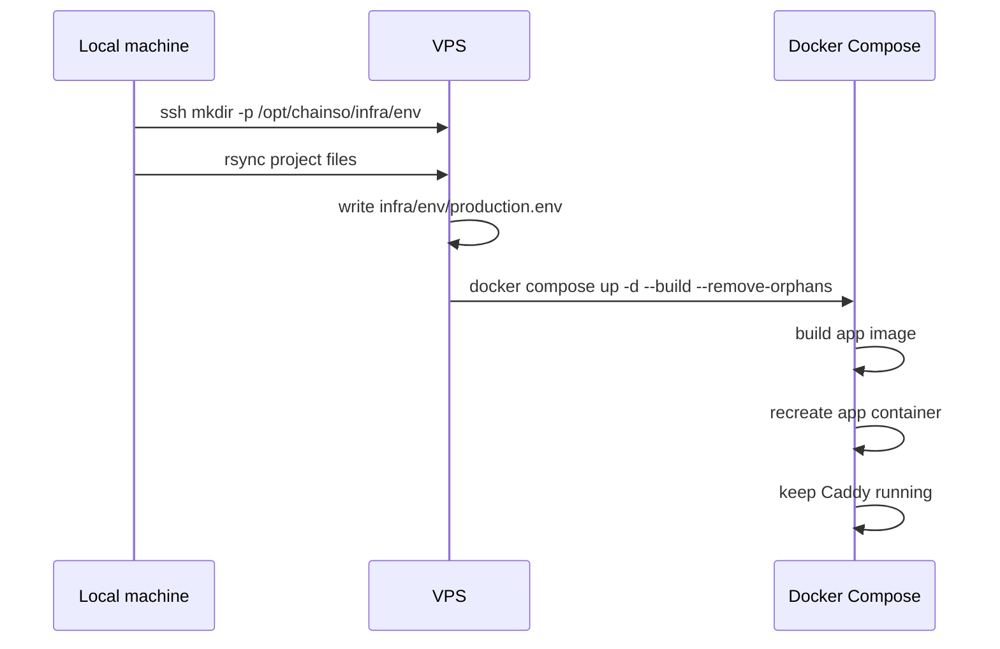
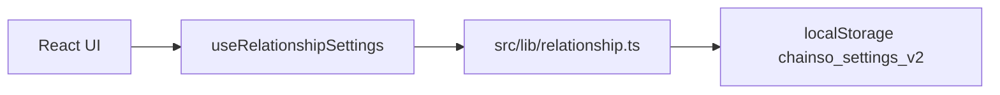
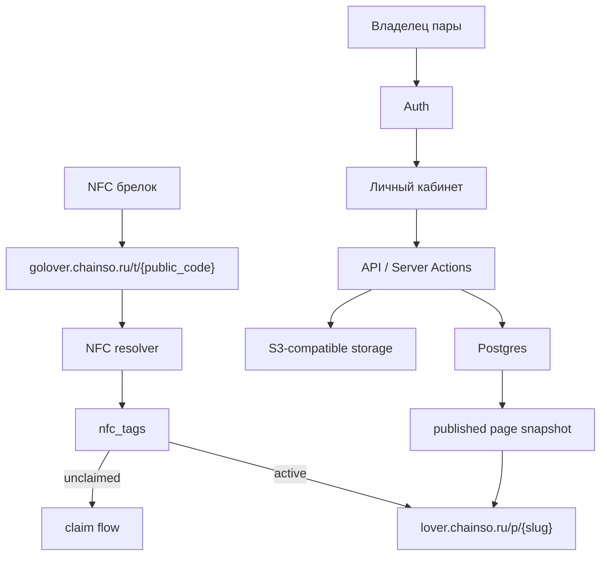
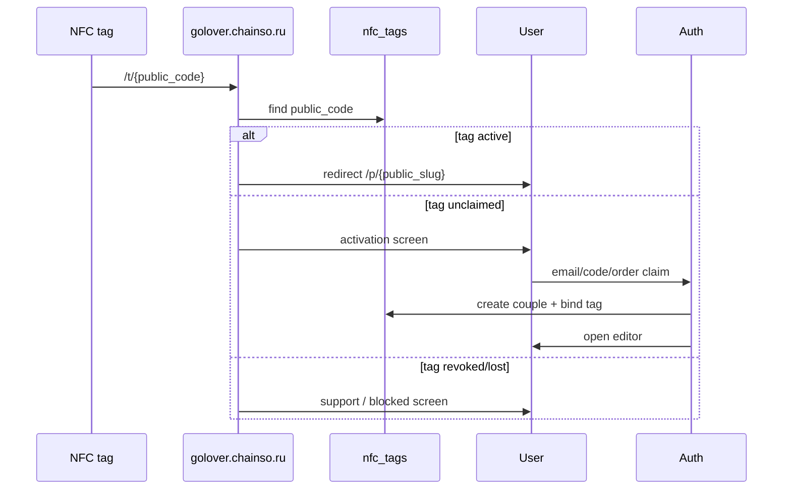
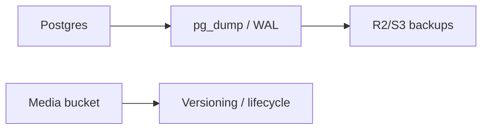

# Chainso: проект, инфраструктура и дальнейшее развитие

Документ описывает текущее состояние проекта Chainso, созданную VPS-инфраструктуру, окружения, деплой-процесс, эксплуатационные команды и рекомендации по развитию продукта в полноценный SaaS вокруг NFC-брелков.

## 1. Что такое Chainso

Chainso сейчас является Next.js-приложением для персональной страницы пары. Пользователь открывает страницу, настраивает имена, дату отношений, тему, виджеты, фотоальбом и холсты. На текущем этапе данные сохраняются на клиенте в `localStorage`.

Целевая продуктовая модель:

- пара покупает NFC-брелок;
- NFC открывает публичный URL;
- URL приводит на страницу пары;
- владельцы страницы редактируют ее через аккаунт;
- NFC является публичным указателем, а не способом авторизации.

Текущая реализация пока является frontend/MVP-слоем. Backend, база данных, полноценная авторизация, NFC claim-flow и storage еще не внедрены.

## 2. Текущий стек

```txt
Next.js 16.2.4
React 19.2.3
TypeScript
Tailwind CSS 4
Docker
Docker Compose
Caddy 2
Ubuntu 24.04 VPS
```

Важные файлы:

```txt
src/app/page.tsx                         главная страница
src/app/settings/page.tsx                настройки
src/app/widget/new/page.tsx              создание/редактирование виджета
src/components/pair/MainScreen.tsx       основной экран пары
src/components/pair/SettingsScreen.tsx   настройки пары/темы/отображения
src/components/pair/NewWidgetScreen.tsx  создание виджетов
src/components/pair/WidgetVisual.tsx     визуальный рендер виджетов
src/components/pair/AppFrame.tsx         общий frame и темы
src/lib/relationship.ts                  модель настроек и localStorage
src/lib/widgetAppearance.ts              обработка изображений/палитр
src/lib/trackLink.ts                     распознавание ссылок на треки
```

Инфраструктурные файлы:

```txt
Dockerfile
compose.prod.yml
infra/caddy/Caddyfile
infra/env/production.example
infra/scripts/bootstrap-ubuntu-docker.sh
scripts/deploy-vps.sh
docs/vps-deploy.md
docs/PROJECT_INFRASTRUCTURE.md
```

## 3. Текущая карта доменов

VPS:

```txt
IP: 2.26.28.68
OS: Ubuntu 24.04.4 LTS
Deploy path: /opt/chainso
Docker project: chainso
```

Домены:

```txt
chainso.ru              главный домен
golover.chainso.ru      будущий NFC resolver / переход к странице пары
lover.chainso.ru        будущая публичная страница пары
staging.chainso.ru      staging
```

Текущий статус после деплоя:

```txt
golover.chainso.ru   -> 2.26.28.68, HTTPS работает
lover.chainso.ru     -> 2.26.28.68, HTTPS работает
staging.chainso.ru   -> 2.26.28.68, HTTPS работает
chainso.ru           -> пока указывает на 95.163.244.138, нужно заменить A-запись на 2.26.28.68
```

Для `chainso.ru` нужно в DNS у регистратора поставить:

```txt
@  A  2.26.28.68
```

Пока корневой домен указывает на чужой IP, Caddy не сможет выпустить для него TLS-сертификат.

## 4. Как все взаимодействует сейчас



Объяснение:

- DNS ведет домены на VPS.
- Caddy слушает `80`, `443`, автоматически получает TLS-сертификаты и проксирует запросы.
- Next.js запущен как standalone server внутри Docker.
- Пользовательские данные пока не уходят на сервер, а сохраняются в `localStorage` браузера.
- Это хорошо для быстрого MVP, но не подходит для реального multi-tenant SaaS без backend.

## 5. Docker-архитектура



`compose.prod.yml` содержит два сервиса:

```txt
app
  build: Dockerfile
  port внутри сети: 3000
  healthcheck: HTTP-запрос на 127.0.0.1:3000
  restart: unless-stopped

caddy
  image: caddy:2-alpine
  ports: 80, 443, 443/udp
  reverse_proxy -> app:3000
  volumes: caddy_data, caddy_config
  restart: unless-stopped
```

`Dockerfile` multi-stage:



Почему `output: "standalone"` включен в `next.config.ts`:

- Next.js собирает минимальный runtime bundle;
- контейнер меньше и проще;
- не нужно тащить весь исходник и dev-зависимости в runtime.

## 6. Окружения

Сейчас фактически есть один Docker stack на VPS, который обслуживает все домены. `staging.chainso.ru` пока смотрит на тот же контейнер, что и production.

Текущее состояние:

```txt
local       локальная разработка через npm run dev
production VPS /opt/chainso, Docker Compose
staging    домен есть, но отдельного приложения/БД пока нет
```

Рекомендуемая следующая схема:



Что стоит сделать дальше:

- завести отдельный compose project `chainso-staging`;
- запустить staging на отдельном порту/отдельном compose file;
- подключить отдельную staging-БД;
- деплоить `main` сначала на staging, потом вручную на production.

## 7. Deploy-процесс

### 7.1. Первый bootstrap VPS

На чистом Ubuntu VPS:

```bash
ssh root@2.26.28.68 'bash -s' < infra/scripts/bootstrap-ubuntu-docker.sh
```

Скрипт:

- добавляет официальный Docker apt repository;
- ставит Docker Engine;
- ставит Docker Compose plugin;
- включает и запускает `docker.service`.

### 7.2. Деплой приложения

Команда для текущего VPS:

```bash
VPS_HOST=2.26.28.68 \
VPS_USER=root \
DEPLOY_PATH=/opt/chainso \
APP_DOMAINS=chainso.ru,golover.chainso.ru,lover.chainso.ru,staging.chainso.ru \
./scripts/deploy-vps.sh
```

Скрипт делает:



Важно:

- `infra/env/production.env` не коммитится;
- домены можно передавать через `APP_DOMAINS`;
- запятые в `APP_DOMAINS` скрипт превращает в пробелы для Caddy.

## 8. Проверки перед деплоем

Локально:

```bash
npm run lint
npm run build
npm audit
docker build -t chainso:test .
```

Smoke-test контейнера:

```bash
docker run --rm -d --name chainso-test -p 3005:3000 chainso:test
docker exec chainso-test node -e "fetch('http://127.0.0.1:3000').then(r=>{console.log(r.status, r.headers.get('content-type')); process.exit(r.ok?0:1)}).catch(()=>process.exit(1))"
docker stop chainso-test
```

На VPS:

```bash
ssh root@2.26.28.68
cd /opt/chainso
set -a && . infra/env/production.env && set +a
docker compose -f compose.prod.yml ps
docker compose -f compose.prod.yml logs -f app
docker compose -f compose.prod.yml logs -f caddy
```

Проверка доменов:

```bash
dig +short chainso.ru
dig +short golover.chainso.ru
dig +short lover.chainso.ru
dig +short staging.chainso.ru

curl -I https://golover.chainso.ru
curl -I https://lover.chainso.ru
curl -I https://staging.chainso.ru
```

Ожидаемый результат для рабочих поддоменов:

```txt
HTTP/2 200
via: 1.1 Caddy
content-type: text/html; charset=utf-8
```

## 9. Caddy и HTTPS

Caddy автоматически:

- принимает HTTP/HTTPS;
- выпускает сертификаты Let's Encrypt;
- редиректит HTTP -> HTTPS;
- проксирует запросы в Next.js container;
- добавляет базовые security headers.

Текущий `Caddyfile`:

```caddyfile
{$APP_DOMAINS} {
  encode zstd gzip

  header {
    Strict-Transport-Security "max-age=31536000; includeSubDomains"
    X-Content-Type-Options "nosniff"
    X-Frame-Options "DENY"
    Referrer-Policy "strict-origin-when-cross-origin"
    Permissions-Policy "camera=(), microphone=(), geolocation=()"
    -Server
  }

  reverse_proxy {$APP_UPSTREAM}
}
```

Если сертификат не выпускается:

```bash
docker compose -f compose.prod.yml logs -f caddy
dig +short <domain>
```

Типовые причины:

- домен еще не указывает на VPS;
- порт `80` или `443` закрыт;
- включен чужой proxy/parking на стороне регистратора;
- DNS TTL еще не обновился.

## 10. Текущее состояние данных

Сейчас данные пары хранятся в браузере:



Плюсы:

- быстро;
- не нужен backend;
- удобно для прототипа.

Минусы:

- данные не синхронизируются между устройствами;
- публичная страница не может быть общей для всех;
- нельзя безопасно привязать NFC-брелок;
- нельзя восстановить данные при очистке браузера;
- невозможно нормальное multi-tenant-разделение клиентов.

Уже убраны демо-данные:

- нет дефолтных имен;
- нет дефолтной даты;
- нет дефолтных виджетов;
- старые demo widgets `default-*` удаляются при нормализации сохраненных настроек.

## 11. Целевая backend-архитектура



Ключевой принцип:

```txt
NFC идентифицирует брелок.
Auth идентифицирует пользователя.
couple_members решает, кто может редактировать страницу.
public_code ведет на страницу, но не дает прав.
```

## 12. Рекомендуемая схема БД

Минимальные таблицы:

```txt
users
couples
couple_members
nfc_tags
orders
widgets
album_photos
drawing_canvases
media_assets
scan_events
audit_events
```

Смысл:

```txt
users              аккаунты владельцев
couples            страницы пар
couple_members     доступ пользователей к редактированию
nfc_tags           NFC-брелки, public_code, status, couple_id
orders             заказы
widgets            виджеты страницы
album_photos       фотоальбом
drawing_canvases   холсты
media_assets       файлы в object storage
scan_events        аналитика сканов
audit_events       история изменений
```

Для публичной страницы стоит добавить:

```txt
couples.published_json
couples.public_slug
couples.status
```

Тогда публичная страница читает один готовый snapshot, а не собирает страницу из множества таблиц на каждый запрос.

## 13. NFC flow



Важно:

- `public_code` можно хранить в NFC URL;
- `public_code` не является секретом;
- claim должен требовать второй фактор владения: код из заказа, код из коробки, email OTP или активацию из кабинета.

## 14. Storage для фото и холстов

Сейчас фото и холсты сохраняются как data URL в localStorage. Для production это нужно заменить.

Рекомендуемый подход:

```txt
Cloudflare R2 / S3 / MinIO
```

Правила:

- не хранить пользовательские изображения в Postgres;
- сохранять только URL/key/metadata;
- ограничивать размер файлов;
- проверять MIME;
- сжимать изображения в WebP/JPEG;
- хранить оригинал только если он реально нужен;
- раздавать через CDN.

## 15. Безопасность VPS

Сейчас для деплоя использовался root-доступ. SSH-ключ добавлен, но пароль root был передан в чат и его нужно считать скомпрометированным.

Сразу сделать:

```bash
passwd
```

Рекомендуемые следующие действия:

```bash
adduser deploy
usermod -aG docker deploy
mkdir -p /home/deploy/.ssh
cp /root/.ssh/authorized_keys /home/deploy/.ssh/authorized_keys
chown -R deploy:deploy /home/deploy/.ssh
chmod 700 /home/deploy/.ssh
chmod 600 /home/deploy/.ssh/authorized_keys
```

После проверки входа под `deploy`:

```txt
/etc/ssh/sshd_config
PasswordAuthentication no
PermitRootLogin prohibit-password
```

Затем:

```bash
systemctl reload ssh
```

Firewall:

```bash
ufw allow OpenSSH
ufw allow 80/tcp
ufw allow 443/tcp
ufw enable
ufw status
```

## 16. Backups

Сейчас на сервере нет БД и пользовательского storage, поэтому критичных пользовательских данных на VPS почти нет. Когда появится backend:

Обязательно:

- ежедневный backup Postgres;
- offsite backup в S3/R2/Backblaze;
- retention минимум 7/30/90;
- тест восстановления раз в месяц;
- отдельный backup production env/secrets.

Пример будущей схемы:



## 17. Логи и мониторинг

Сейчас:

```bash
docker compose -f compose.prod.yml logs -f app
docker compose -f compose.prod.yml logs -f caddy
```

Рекомендовано добавить:

- Sentry для frontend/runtime ошибок;
- uptime monitor для доменов;
- basic server metrics: CPU/RAM/disk;
- алерт на падение контейнера;
- алерт на истечение/ошибки TLS.

Минимум:

```txt
UptimeRobot / Better Stack / Grafana Cloud Free
Sentry
```

## 18. Работа с DNS

Для текущего VPS все production/staging домены должны указывать на:

```txt
2.26.28.68
```

Записи:

```txt
@        A  2.26.28.68
golover  A  2.26.28.68
lover    A  2.26.28.68
staging  A  2.26.28.68
```

Проверка:

```bash
dig +short chainso.ru
dig +short golover.chainso.ru
dig +short lover.chainso.ru
dig +short staging.chainso.ru
```

Если Caddy не получил сертификат, сначала проверять DNS.

## 19. Рекомендуемый roadmap

### Этап 1. Укрепить текущий VPS MVP

- заменить root password;
- создать `deploy` пользователя;
- отключить password SSH login;
- включить firewall;
- поправить `chainso.ru` DNS;
- добавить uptime monitor;
- добавить Sentry.

### Этап 2. Вынести данные из localStorage

- выбрать backend stack: Supabase/Postgres или self-hosted Postgres;
- сделать таблицы `couples`, `widgets`, `album_photos`, `drawing_canvases`;
- сделать auth;
- сделать `/p/[slug]` для публичной страницы;
- сделать `/app` для редактора.

### Этап 3. NFC layer

- добавить `nfc_tags`;
- добавить `golover.chainso.ru/t/[publicCode]`;
- добавить activation/claim flow;
- добавить статусы `manufactured`, `sold`, `claimed`, `active`, `revoked`, `lost`.

### Этап 4. Storage

- подключить Cloudflare R2/S3;
- заменить data URL в localStorage на media assets;
- добавить image compression pipeline;
- добавить CDN cache.

### Этап 5. Admin и заказы

- админка партий NFC;
- заказы;
- связь order -> tag -> couple;
- поддержка перевыпуска/блокировки брелков.

### Этап 6. Нормальный staging/prod

- отдельный staging stack;
- отдельная staging DB;
- CI/CD;
- миграции;
- smoke tests перед production.

## 20. Быстрый cheat sheet

Локально:

```bash
npm run dev
npm run lint
npm run build
npm audit
```

Деплой:

```bash
VPS_HOST=2.26.28.68 \
VPS_USER=root \
DEPLOY_PATH=/opt/chainso \
APP_DOMAINS=chainso.ru,golover.chainso.ru,lover.chainso.ru,staging.chainso.ru \
./scripts/deploy-vps.sh
```

Проверка VPS:

```bash
ssh root@2.26.28.68
cd /opt/chainso
set -a && . infra/env/production.env && set +a
docker compose -f compose.prod.yml ps
docker compose -f compose.prod.yml logs -f app
docker compose -f compose.prod.yml logs -f caddy
```

Проверка доменов:

```bash
curl -I https://golover.chainso.ru
curl -I https://lover.chainso.ru
curl -I https://staging.chainso.ru
```

Перезапуск:

```bash
docker compose -f compose.prod.yml restart
```

Полная пересборка на VPS:

```bash
docker compose -f compose.prod.yml up -d --build --remove-orphans
```

## 21. Главные выводы

Текущая инфраструктура уже подходит для MVP:

- приложение контейнеризовано;
- есть reverse proxy;
- есть HTTPS;
- есть повторяемый deploy;
- есть подготовка под перенос на более мощную архитектуру.

Но текущий продукт еще не является полноценным SaaS, потому что:

- нет backend;
- нет server-side идентификации пары;
- нет auth;
- нет NFC resolver;
- нет storage;
- нет БД;
- staging пока не отделен от production.

Следующий крупный шаг: перенести состояние пары из `localStorage` в backend и ввести модель `couple -> members -> public page -> nfc_tags`.
